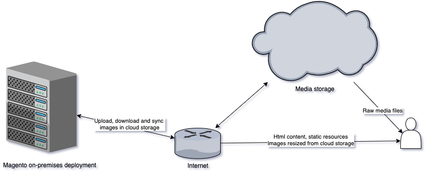
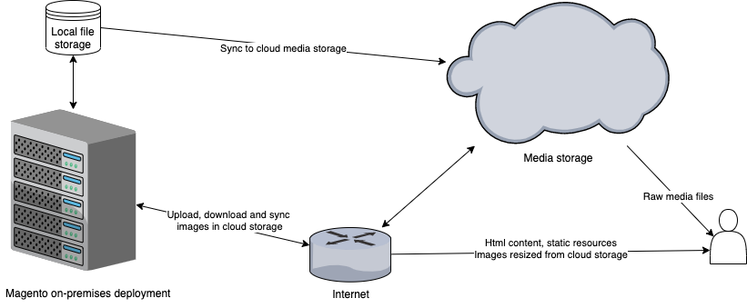

.. include:: ../README.rst

Use cases
==========

On premises deployment with cloud file storage and CDN in cloud
-----------------------------------------------------------------

Even if this is not the lucky case this module could be used for this use-case, but some latency problems may occur on admin panel.

Store media files using remote cloud services, process images on application server.

.. note::
    Optimization could be achieved if resize script could be moved in same data-center with media storage service.

Migration to cloud from on premises infrastructure
-----------------------------------------------------------------

In migration stage this module could be used as a mean to migrate media files to cloud storage service.

Already using cloud other services
-----------------------------------------------------------------

.. note::
    All notes above apply to this case, and the advantage of having the storage system and computing ones in same data-center will assure best performance and const-effective setup.

Features
==========

Catalog product file storage
-----------------------------------------------------------------

WYSIWYG  images storage
-----------------------------------------------------------------

Photo upload and management in admin
-----------------------------------------------------------------

Sync corn between filesystems
-----------------------------------------------------------------

Difference report between filesystems
-----------------------------------------------------------------

Multiple cloud buckets mapping for each main directory
-----------------------------------------------------------------
